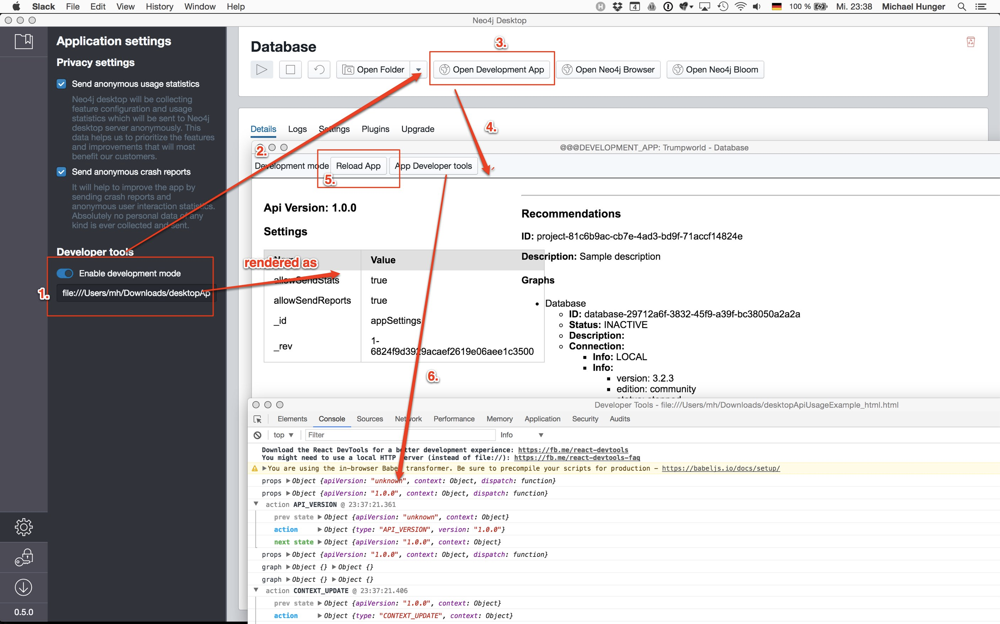

# Neo4j Desktop Graph App API

To give a 3rd party applications the possibility to know,
what active graph is and where it is contained, we provide a context.

First of all, context expose to the apps all data, that could be viable for them to operate -
configurations, projects, graphs.

Context itself is an immutable structure which is generated on demand,
but all context changes are interceptable, so the apps could react to context changes immediately.

Check out [Changelog](CHANGELOG.md) to follow API changes.

## Development mode

Neo4j Desktop have `Development mode`.

To enable it, open `Settings` pane in Sidebar and toggle switch in `Developer tools` section.

#### Entry point

When development mode is enabled, additional app is added to the list of other apps: `Development App`.

Developer needs to setup entry point and application root directory for Graph App in settings.

Settings:

* Entry Point
  * Supported formats:
      * File: load `.html` file directly from filesystem
        * Example: `file:///Users/me/work/graph-app/index.html`
      * HTTP: load arbitrary `URL`
        * Example: `http://localhost:3000`
* Root Path
    * Example: `/Users/me/work/graph-app`

**Note:** settings are not saved between Neo4j Desktop restarts.



## Example

Available examples:

- [Simple single file Graph Application](examples/basic-single-file)
- [Simple application created with create-react-app](examples/basic-create-react-app)

#### Quickstart example

```js
/**
 * If application can run in multiple environments, detect that we are in Desktop. 
 */
if (window.neo4jDesktopApi) {
    // API will be available in global `window` variable `neo4jDesktopApi`.

    
    // Listen for context changes
    neo4jDesktopApi.onContextUpdate((event, newContext, oldContext) => {
        if (event.type === '...') {
            // do something if event is of specific type
        }
        
       // check context changes and apply them
    });
    
    // Get current context. 
    // Should be used if application requires current context when it starts.
    neo4jDesktopApi.getContext()
        .then((context) => {
            // initialize application with context
        });   
}
```

## Distribution

Graph App should be distributed as a valid [npm package file](https://docs.npmjs.com/files/package.json),
where `dist` folder contains a default app entry point `index.html`. App should be extractable as `zip`/`tgz` file.

Manifest file `package.json` should also include Neo4j Desktop API version that is used.

Example:

```json
{
    "name": "",
    "description": "",
    "neo4jDesktop": {
        "apiVersion": "1.0.0"
    }
}
```

## Reference 

*Note:* API is under development and it can be changed, based on user feedback.

*Note:* API definition is presented using [Flow](flow.org) syntax.

```js
// Types are defined using Flow syntax.

window.neo4jDesktopApi = {
    /**
     * Asynchronously get current context.
     */
    getContext: () => Promise<Context>,
    
    /**
     * Register callback to receive context updates when events are happening.
     */
    onContextUpdate: (event: Event, newContext: Context, oldContext: Context) => void,
    
    /**
     *  Execute any jar, bundled inside you app package or given path. Will return complete stdout 
     */
    executeJava: (parameters: JavaParameters) => JavaResult
};

export type JavaParameters = {
    /**
     * Specify class or jar that should be executed.
     * Path to a .jar file can either be relative to App Path or absolute.
     * Example: 'Main'
     * Example: './test.jar'
     */
    ['class' | 'jar']: string,
    
    /**
     * JVM arguments.
     * Example: ['-DmyProperty=value', '-Xdebug']
     */
    options: string[],
    
    /**
     * Jar's that will be added to classpath.
     * Example: ['./test.jar', '/opt/lib/test.jar']
     */
    classpath: string[],
    
    /**
     * Argument passed to a main.
     * Example: ['one', 'two', 'three']
     */
    arguments: string[]
}

export type JavaResult = {
    stdout: string,
    stderr: string
}

type Context = {
    global: {
        settings: Settings
    },
    projects: Array<Project>
};

type Settings = {
    allowSendStats: boolean,
    allowSendReports: boolean
};

type Project = {
    id: string,
    name: string,
    graphs: Array<Graph>
};

type Graph = {
    id: string,
    name: string,
    description: string,
    status: 'ACTIVE' | 'INACTIVE',
    connection: GraphLocalConnection
};

type GraphLocalConnection = {
    type: 'LOCAL',
    connection: {
        info: {
            version: string,
            edition: string,
            status: GraphLocalConnectionStatus
        },
        configuration: GraphLocalConnectionInactiveConfiguration | GraphLocalConnectionActiveConfiguration
    }
};

type GraphLocalConnectionStatus =
    | 'stopped'
    | 'stopping'
    | 'starting'
    | 'restarting'
    | 'running'
    | 'unknown'
    | 'new'
    | 'creating'
    | 'removing'
    | 'upgrading'
    | 'missing'
;

// If Graph.status === 'ACTIVE'
type GraphLocalConnectionInactiveConfiguration = {
    path: string
};

// If Graph.status === 'INACTIVE'
type GraphLocalConnectionActiveConfiguration = {
    path: string,
    host: string,
    port: string,
    encrypted: boolean
};

type Event = 
    | ProjectCreatedEvent
    | ProjectRemovedEvent
    | ProjectRenamedEvent
    | DatabaseCreatedEvent
    | DatabaseStartedEvent
    | DatabaseStoppedEvent
    | DatabaseRenamedEvent
    | DatabaseRemovedEvent
    | DatabaseUpdatedEvent
    | DatabaseUpgradedEvent
;

type ProjectCreatedEvent = {
    type: 'PROJECT_CREATED',
    id: string,
    name: string
}

type ProjectRemovedEvent = {
    type: 'PROJECT_REMOVED',
    id: string
}

type ProjectRenamedEvent = {
    type: 'PROJECT_RENAMED',
    id: string,
    name: string
}

type DatabaseCreatedEvent = {
    type: 'DATABASE_CREATED',
    id: string,
    projectId: string,
    name: string,
    description: string,
    status: GraphLocalConnectionStatus,
    version: string,
    edition: 'community' | 'enterprise'
};

type DatabaseStartedEvent = {
    type: 'DATABASE_STARTED',
    id: string
};

type DatabaseStoppedEvent = {
    type: 'DATABASE_STOPPED',
    id: string
};

type DatabaseRenamedEvent = {
    type: 'DATABASE_RENAMED',
    id: string,
    name: string
};

type DatabaseRemovedEvent = {
    type: 'DATABASE_REMOVED',
    id: string
};

type DatabaseUpdatedEvent = {
    type: 'DATABASE_UPDATED',
    id: string,
    database: {
        description: string
    }
};

type DatabaseUpgradedEvent = {
    type: 'DATABASE_UPGRADED',
    id: string,
    version: string
};
```
